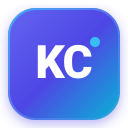

<p align="center">
  <br/>
  <b>Positional Prompts Power for Kiro ⚡</b><br/>
  <sub>Created by <b>Krishna Chaitanya Rupavatharam</b> (<b>KC</b>)</sub>
</p>

<p align="center">
  <a href="LICENSE"></a>
  <a href="https://nodejs.org/"></a>
  <a href="https://modelcontextprotocol.io/"></a>
  <a href="https://agent-plugins.org/"></a>
  <a href="test.js"></a>
</p>

> Bring GitHub Copilot-style positional parameter prompts (`{0}`, `{1}`, `$1`, `$2`) and interactive slash commands to **Kiro** and any **MCP-compatible** agent.

Define prompt templates once with positional or named placeholders, then fill them with arguments on the fly directly in chat or via AI agent tools.

---

## ✨ Features

- 🚀 **Interactive Slash Commands**: Pre-loaded with ready-to-use slash commands (`/code-review`, `/test-generator`, `/refactor`, etc.) that appear directly in Kiro's `/` completion menu.
- 🎯 **Flexible Placeholders**:
  - `{0}`, `{1}`, `{2}` *(0-indexed)*
  - `${1}`, `${2}` or `$1`, `$2` *(1-indexed Copilot & shell style)*
  - `{language}`, `{code}`, `{focus}` *(named variables)*
- 🛠️ **Dual Protocol Support**:
  - **MCP Prompts Protocol** (`prompts/list`, `prompts/get`) for instant IDE slash commands.
  - **MCP Tools Protocol** (`create_template`, `render_prompt`, `list_templates`, `get_template`, `delete_template`) for agentic workflows.
- 💾 **Persistent Cross-Session Storage**: Stored locally in `~/.kiro/positional-prompts/templates.json`.
- 🪶 **Zero External Dependencies**: Pure Node.js standard library (no bloated `node_modules`).
- 🌐 **Cross-Platform**: Windows, macOS, and Linux.

---

## 💡 Example Templates You Can Create
 
The Power starts with a clean, empty template store—giving you full control over what prompts exist. Here are popular template examples you can define:
 
| Template Name | Parameters | Example Purpose |
|---|---|---|
| `code-review` | `language`, `code`, `focus` | In-depth code review for quality, security, and edge cases |
| `test-generator` | `language`, `code`, `test_scope` | Generates comprehensive unit test suites |
| `refactor` | `language`, `code`, `constraints`, `goal` | Refactors code while enforcing non-breaking constraints |
| `bug-analysis` | `language`, `error_message`, `code`, `expected_behavior` | Diagnoses stack traces and provides the patch |
| `explain` | `language`, `audience`, `code` | Explains logic tailored to junior, mid, or senior developers |
| `api-design` | `api_type`, `use_case`, `requirements`, `constraints` | Designs REST, GraphQL, or gRPC endpoint contracts |

---

## 🚀 Quick Install

### Method 1: Install from Kiro UI (Recommended)

1. Open **Kiro** → Click on the **Powers** panel.
2. Click **Add plugin from GitHub**.
3. Enter:
   ```text
   kc-agile/kiro-positional-prompts
   ```
4. Click **Install** and restart Kiro.

---

### Method 2: Git Clone into Kiro Plugins

Clone directly into your local Kiro plugins directory:

**macOS / Linux:**
```bash
git clone https://github.com/kc-agile/kiro-positional-prompts.git ~/.kiro/plugins/positional-prompts
```

**Windows (PowerShell):**
```powershell
git clone https://github.com/kc-agile/kiro-positional-prompts.git "$HOME\.kiro\plugins\positional-prompts"
```

Restart Kiro to auto-discover via `plugin.json`.

---

### Method 3: Standard MCP Configuration

To add this server directly to your Kiro workspace settings (`.kiro/settings/mcp.json`), or other MCP clients (Claude Desktop, Cursor):

```json
{
  "mcpServers": {
    "positional-prompts": {
      "command": "node",
      "args": ["c:/path/to/kiro-positional-prompts/server.js"]
    }
  }
}
```

---

## 💡 How to Use

### 1. In Kiro Chat (Interactive Slash Command)

Type `/` in chat to see your prompts with argument auto-complete:

```text
/code-review language="TypeScript" code="const add = (a: number, b: number) => a + b;" focus="type safety"
```

Or pass positional values:
```text
/code-review TypeScript "const add = (a: number, b: number) => a + b;" "type safety"
```

### 2. Creating New Templates On the Fly

Ask Kiro:
> *"Create a prompt template called `sql-optimizer` that takes dialect, query, and target latency."*

The agent will call the `create_template` tool:
```json
{
  "name": "sql-optimizer",
  "template": "Optimize this {0} SQL query:\n\n```sql\n{1}\n```\n\nTarget latency: {2}",
  "description": "SQL optimization template",
  "paramNames": ["dialect", "query", "target_latency"]
}
```

Once created, it is immediately available as `/sql-optimizer` in chat!

---

## 🛠️ MCP Tools Reference

| Tool | Purpose | Parameters |
|---|---|---|
| `create_template` | Store a new reusable template | `name` (string), `template` (string), `description` (optional), `paramNames` (optional array) |
| `render_prompt` | Fill a template with arguments | `name` (string), `args` (array or object) |
| `list_templates` | List all stored templates | *(none)* |
| `get_template` | Retrieve template details | `name` (string) |
| `delete_template` | Remove an existing template | `name` (string) |

---

## 🧪 Verification & Testing

Verify that your MCP server passes all handshake and protocol checks:

```bash
git clone https://github.com/kc-agile/kiro-positional-prompts.git
cd kiro-positional-prompts
npm test
```

Expected output:
```text
🧪 Starting Positional Prompts Power test suite...

1️⃣  Testing MCP initialize handshake...
   ✓ Handshake successful: serverInfo = { name: 'positional-prompts', version: '1.0.0' }

2️⃣  Testing MCP prompts/list...
   ✓ Found 6 prompts: code-review, test-generator, refactor, bug-analysis, explain, api-design

3️⃣  Testing MCP prompts/get (code-review)...
   ✓ Rendered prompt content:
   ----------------------------------------
   Review this TypeScript code:
   ...
   ----------------------------------------

4️⃣  Testing MCP tools/list...
   ✓ Found 5 tools: create_template, render_prompt, list_templates, get_template, delete_template

🎉 ALL TESTS PASSED SUCCESSFULLY!
```

---

## 📂 Project Architecture

```
kiro-positional-prompts/
├── plugin.json               # Agent Plugins 1.0.0 manifest for Kiro Power discovery
├── mcp.json                  # MCP server configuration
├── server.js                 # Standalone MCP server (Prompts + Tools + Persistence)
├── test.js                   # Automated test suite validating MCP protocol
├── package.json              # npm package metadata
├── LICENSE                   # MIT License
├── skills/
│   └── positional-prompts/
│       └── SKILL.md          # Agent skill instructions & best practices
├── guides/                   # Detailed guides (team workflow, advanced usage)
└── examples/
    └── templates.json        # Reference templates export
```

---

## 👤 Author

<div align="right">
  <table>
    <tr>
      <td align="center" width="56" valign="middle">
        <a href="https://github.com/kc-agile">
          
        </a>
      </td>
      <td align="left" valign="middle">
        <b>Krishna Chaitanya Rupavatharam</b> &nbsp;<code>KC</code><br/>
        <a href="https://github.com/kc-agile">@kc-agile</a> • Built for Kiro & MCP Community
      </td>
    </tr>
  </table>
</div>

## 📄 License

This project is licensed under the [MIT License](LICENSE).

