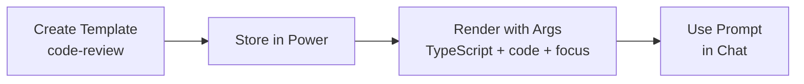

# Positional Prompts Power

## Overview

This power lets teams create reusable prompt templates with positional parameters and fill them with context-specific arguments.

## Quick Start

### 1. Create a Template

Use the `create_template` tool to define a prompt template:

```
name: "code-review"
template: "Review this {0} code:\n\n{1}\n\nFocus on: {2}"
description: "Template for code review tasks"
```

### 2. Render (Fill) the Template

Use `render_prompt` to substitute arguments:

```
name: "code-review"
args: ["TypeScript", "function add(a, b) { return a + b; }", "type safety and edge cases"]
```

**Result:**
```
Review this TypeScript code:

function add(a, b) { return a + b; }

Focus on: type safety and edge cases
```

## Available Tools

### `create_template`
Store a prompt template for reuse.

**Parameters:**
- `name` (string): Template identifier (e.g., "code-review", "test-generator")
- `template` (string): Template with positional placeholders: `{0}`, `{1}`, etc.
- `description` (string, optional): What the template does

**Example:**
```json
{
  "name": "generate-tests",
  "template": "Write unit tests for this {0} function:\n\n{1}\n\nTest coverage should include: {2}",
  "description": "Generate test cases for a function"
}
```

### `render_prompt`
Fill a template with arguments.

**Parameters:**
- `name` (string): Template name
- `args` (array of strings): Values for {0}, {1}, etc., in order

**Example:**
```json
{
  "name": "generate-tests",
  "args": ["JavaScript", "const validate = (email) => /^.+@.+\\..+$/.test(email);", "valid emails, invalid emails, edge cases"]
}
```

### `list_templates`
See all stored templates.

### `get_template`
Retrieve a single template's details.

## Use Cases

- **Code Review**: Template for structured code review prompts with language, code snippet, and focus areas.
- **Test Generation**: Template for generating tests with function type, code, and coverage scope.
- **Documentation**: Template for writing docs with tech, component, and audience.
- **Refactoring**: Template for refactoring tasks with language, before code, and constraints.

## Workflow Example



## Tips

- Keep templates generic and reusable
- Use clear parameter names (e.g., `{0}` = language, `{1}` = code, `{2}` = focus)
- Document your templates in your team's steering files
- Test templates with different argument combinations

## Persistence

Out of the box, templates live in memory for the session. To persist templates across sessions, add a backing store (file, database) to `server.js`.
